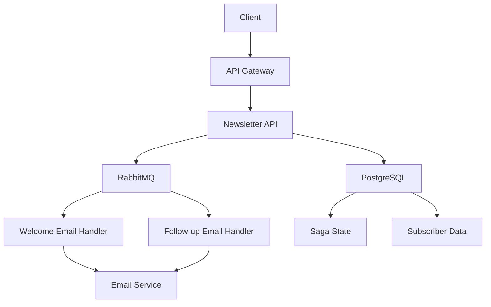

# ✉️ Advanced Newsletter System with MassTransit, Saga, and RabbitMQ

This repository demonstrates a sophisticated **Newsletter System** built with **MassTransit**, **Saga Pattern**, and **RabbitMQ**, showcasing the true potential of event-driven architecture. The application features complex email workflows such as sending **welcome emails** and **follow-up emails** using advanced event-driven design principles.

It also integrates **EF Core** and **PostgreSQL** for persistence, making it a robust solution for managing complex messaging workflows in a scalable and maintainable manner.

## 📚 Documentation

- [Architecture Overview](docs/architecture.md) - Detailed system architecture and message flow diagrams

## 🌟 Features

### Core Event-Driven Architecture Concepts
- **MassTransit**: Advanced message broker library for .NET with support for Sagas and complex workflows
- **Saga Pattern**: Orchestrates long-running distributed workflows, ensuring consistency in distributed systems
- **RabbitMQ**: Robust message queuing and delivery system for asynchronous communication
- **NSwag**: API documentation and testing with Swagger integration

### Advanced Workflow Examples
- **Welcome Email Workflow**: Automatically sends a welcome email when a user subscribes
- **Follow-Up Email Workflow**: Sends follow-up emails to engage with subscribers based on time delays
- **Saga State Management**: Tracks complex multi-step processes with state persistence
- **Event Sourcing**: Full event history for audit and replay capabilities

### Tools and Libraries
- **EF Core**: Handles data persistence for Saga states and other entities
- **PostgreSQL**: A powerful relational database for storage
- **NSwag**: API documentation generation and client SDK generation
- **Docker**: Containerized deployment for easy setup and scaling

## 📂 Repository Structure

```
📦 Newsletter.Api
 ┣ 📂 Controllers              # API Controllers with Swagger documentation
 ┣ 📂 Database                 # EF Core DbContext and entity models
 ┣ 📂 Emails                   # Email service implementations
 ┣ 📂 Handlers                 # MassTransit message consumers
 ┣ 📂 Messages                 # Commands and Events definitions
 ┣ 📂 Migrations               # EF Core database migrations
 ┣ 📂 Sagas                   # Saga state machines and data models
 ┣ 📜 Program.cs              # Application entry point and DI configuration
 ┣ 📜 appsettings.json        # Configuration settings
 ┗ 📜 Newsletter.Api.csproj   # Project dependencies
```

## 🛠 Getting Started

### Prerequisites
Ensure you have the following installed:
- .NET 9.0 SDK
- Docker and Docker Compose (recommended for easy setup)
- Visual Studio 2022 or VS Code

### Quick Start with Docker (Recommended)
```bash
# Clone the repository
git clone https://github.com/MrEshboboyev/newsletter.git
cd newsletter

# Start all services with Docker Compose
docker-compose up -d

# The application will be available at:
# API: http://localhost:8080
# Swagger UI: http://localhost:8080/swagger
# RabbitMQ Management: http://localhost:15672 (guest/guest)
# PostgreSQL: localhost:5432 (postgres/postgres)
```

### Manual Setup
1. Start RabbitMQ and PostgreSQL services
2. Update connection strings in `appsettings.json` if needed
3. Run the application:
```bash
dotnet run --project src/Newsletter.Api
```

## 📖 Code Highlights

### Advanced Saga State Machine
```csharp
public class NewsletterOnboardingSaga : MassTransitStateMachine<NewsletterOnboardingSagaData>
{
    public State Welcoming { get; set; }
    public State FollowingUp { get; set; }
    public State Onboarding { get; set; }

    public Event<SubscriberCreated> SubscriberCreated { get; set; }
    public Event<WelcomeEmailSent> WelcomeEmailSent { get; set; }
    public Event<FollowUpEmailSent> FollowUpEmailSent { get; set; }

    public NewsletterOnboardingSaga()
    {
        InstanceState(x => x.CurrentState);

        Event(() => SubscriberCreated, e => e.CorrelateById(context => context.Message.SubscriberId));
        Event(() => WelcomeEmailSent, e => e.CorrelateById(context => context.Message.SubscriberId));
        Event(() => FollowUpEmailSent, e => e.CorrelateById(context => context.Message.SubscriberId));

        Initially(
            When(SubscriberCreated)
                .Then(context =>
                {
                    context.Saga.SubscriberId = context.Message.SubscriberId;
                    context.Message.SubscriberId = context.Message.SubscriberId;
                })
                .TransitionTo(Welcoming)
                .Publish(context => new SendWelcomeEmail(context.Message.SubscriberId, context.Message.Email)));

        During(Welcoming,
            When(WelcomeEmailSent)
                .Then(context => context.Saga.WelcomeEmailSent = true)
                .TransitionTo(FollowingUp)
                .Publish(context => new SendFollowUpEmail(context.Message.SubscriberId, context.Message.Email)));

        During(FollowingUp,
            When(FollowUpEmailSent)
                .Then(context =>
                {
                    context.Saga.FollowUpEmailSent = true;
                    context.Saga.OnboardingCompleted = true;
                })
                .TransitionTo(Onboarding)
                .Publish(context => new OnboardingCompleted
                {
                    SubscriberId = context.Message.SubscriberId,
                    Email = context.Message.Email
                })
                .Finalize());
    }
}
```

### RabbitMQ Integration with MassTransit
```csharp
builder.Services.AddMassTransit(busConfigurator =>
{
    busConfigurator.SetKebabCaseEndpointNameFormatter();

    busConfigurator.AddConsumers(typeof(Program).Assembly);

    busConfigurator.AddSagaStateMachine<NewsletterOnboardingSaga, NewsletterOnboardingSagaData>()
        .EntityFrameworkRepository(r =>
        {
            r.ExistingDbContext<AppDbContext>();
            
            r.UsePostgres();
        });

    busConfigurator.UsingRabbitMq((context, cfg) =>
    {
        cfg.Host(new Uri(builder.Configuration.GetConnectionString("RabbitMQ")!), hst =>
        {
            hst.Username("guest");
            hst.Password("guest");
        });
        
        cfg.UseInMemoryOutbox(context);
        
        cfg.ConfigureEndpoints(context);
    });
});
```

### NSwag API Documentation Configuration
```csharp
builder.Services.AddSwaggerDocument(config =>
    config.PostProcess = (settings =>
            {
                settings.Info.Title = "Newsletter API";
                settings.Info.Version = "v1";
                settings.Info.Description = "An event-driven newsletter system built with MassTransit, Saga, and RabbitMQ.";
            }
        ));
```

### API Controller with Swagger Annotations
```csharp
[ApiController]
[Route("api/[controller]")]
[Produces("application/json")]
public class NewsletterController : ControllerBase
{
    private readonly IBus _bus;

    public NewsletterController(IBus bus)
    {
        _bus = bus;
    }

    /// <summary>
    /// Subscribe to the newsletter
    /// </summary>
    /// <param name="email">The email address to subscribe</param>
    /// <returns>Accepted result</returns>
    [HttpPost("subscribe")]
    [ProducesResponseType(StatusCodes.Status202Accepted)]
    [ProducesResponseType(StatusCodes.Status400BadRequest)]
    public async Task<IActionResult> Subscribe([FromBody] string email)
    {
        if (string.IsNullOrWhiteSpace(email))
        {
            return BadRequest("Email is required");
        }

        await _bus.Publish(new SubscribeToNewsLetter(email));
        return Accepted();
    }
}
```

## 🌐 Use Cases

### 1. Welcome Email Workflow
- Triggered when a user subscribes to the newsletter
- Ensures the user receives a personalized welcome email
- Tracks state transitions using Saga pattern

### 2. Follow-Up Email Workflow
- Automates sending follow-up emails to keep users engaged
- Implements time-based delays between messages
- Tracks state transitions using Saga

### 3. Complex Multi-Step Onboarding
- Orchestrates the complete onboarding process
- Maintains state across service boundaries
- Provides audit trail of all events

## 🎯 Advanced Event-Driven Architecture Benefits

### Scalability
- Asynchronous message processing allows for horizontal scaling
- Independent service scaling based on workload
- Load balancing through RabbitMQ

### Resilience
- Message persistence in RabbitMQ ensures no data loss
- Retry mechanisms for failed message processing
- Saga pattern maintains consistency across failures

### Maintainability
- Loose coupling between services
- Clear separation of concerns
- Easy to add new workflow steps

### Observability
- Full event history for debugging and auditing
- RabbitMQ management interface for monitoring
- Structured logging for tracing

## 🚀 API Endpoints

| Endpoint | Method | Description |
|----------|--------|-------------|
| `/api/newsletter/subscribe` | POST | Subscribe an email to the newsletter |
| `/api/newsletter/health` | GET | Health check endpoint |
| `/swagger` | GET | API documentation (Swagger UI) |

## 📊 System Architecture



## 🏗 About the Author
This project was developed by [MrEshboboyev](https://github.com/MrEshboboyev), a software developer passionate about event-driven systems, clean code, and distributed architectures.

## 📄 License
This project is licensed under the MIT License. Feel free to use and adapt the code for your own projects.

## 🔖 Tags
C#, .NET, MassTransit, Saga, RabbitMQ, EF Core, PostgreSQL, Event-Driven Architecture, Messaging, Newsletter System, Clean Code, NSwag, Swagger, Docker

---