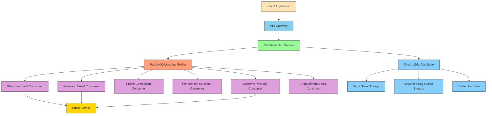

# ✉️ Advanced Newsletter System with MassTransit, Saga, and RabbitMQ

This repository demonstrates a sophisticated **Newsletter System** built with **MassTransit**, **Saga Pattern**, and **RabbitMQ**, showcasing the true potential of event-driven architecture. The application features complex email workflows such as sending **welcome emails** and **follow-up emails** using advanced event-driven design principles.

It also integrates **EF Core** and **PostgreSQL** for persistence, making it a robust solution for managing complex messaging workflows in a scalable and maintainable manner.

## 📚 Documentation

- [Architecture Overview](docs/architecture.md) - Detailed system architecture and message flow diagrams

## 🌟 Features

### Core Event-Driven Architecture Concepts
- **MassTransit**: Advanced message broker library for .NET with support for Sagas and complex workflows
- **Saga Pattern**: Orchestrates long-running distributed workflows, ensuring consistency in distributed systems
- **RabbitMQ**: Robust message queuing and delivery system for asynchronous communication
- **NSwag**: API documentation and testing with Swagger integration

### Advanced Workflow Examples
- **Welcome Email Workflow**: Automatically sends a welcome email when a user subscribes
- **Follow-Up Email Workflow**: Sends follow-up emails to engage with subscribers based on time delays
- **Advanced Onboarding Workflow**: Multi-step onboarding process with profile completion, preferences selection, welcome package, and engagement scheduling
- **Saga State Management**: Tracks complex multi-step processes with state persistence
- **Compensation Patterns**: Automatic rollback mechanisms for failed operations
- **Event Sourcing**: Full event history for audit and replay capabilities

### Resilience and Reliability Features
- **Retry Mechanisms**: Automatic retry with exponential backoff for transient failures
- **Circuit Breaker**: Prevents cascading failures during service outages
- **Fault Tolerance**: Graceful degradation and error handling
- **Dead Letter Queues**: Captures and isolates failed messages for analysis

### Monitoring and Observability
- **Distributed Tracing**: End-to-end request tracking with OpenTelemetry
- **Metrics Collection**: Real-time performance and business metrics
- **Health Checks**: Comprehensive system health monitoring
- **Structured Logging**: Detailed diagnostic information for troubleshooting

### Tools and Libraries
- **EF Core**: Handles data persistence for Saga states and other entities
- **PostgreSQL**: A powerful relational database for storage
- **NSwag**: API documentation generation and client SDK generation
- **Docker**: Containerized deployment for easy setup and scaling
- **OpenTelemetry**: Industry-standard observability framework

## 📂 Repository Structure

```
📦 Newsletter.Api
 ┣ 📂 Controllers              # API Controllers with Swagger documentation
 ┣ 📂 Database                 # EF Core DbContext and entity models
 ┣ 📂 Emails                   # Email service implementations
 ┣ 📂 Handlers                 # MassTransit message consumers
 ┣ 📂 Messages                 # Commands and Events definitions
 ┣ 📂 Migrations               # EF Core database migrations
 ┣ 📂 Sagas                   # Saga state machines and data models
 ┣ 📂 Services                 # Business services and metrics collection
 ┣ 📂 Middleware               # Custom middleware components
 ┣ 📜 Program.cs              # Application entry point and DI configuration
 ┣ 📜 appsettings.json        # Configuration settings
 ┗ 📜 Newsletter.Api.csproj   # Project dependencies
```

## 🛠 Getting Started

### Prerequisites
Ensure you have the following installed:
- .NET 9.0 SDK
- Docker and Docker Compose (recommended for easy setup)
- Visual Studio 2022 or VS Code

### Quick Start with Docker (Recommended)
```bash
# Clone the repository
git clone https://github.com/MrEshboboyev/newsletter.git
cd newsletter

# Start all services with Docker Compose
docker-compose up -d

# The application will be available at:
# API: http://localhost:8080
# Swagger UI: http://localhost:8080/swagger
# RabbitMQ Management: http://localhost:15672 (guest/guest)
# PostgreSQL: localhost:5432 (postgres/postgres)
```

### Manual Setup
1. Start RabbitMQ and PostgreSQL services
2. Update connection strings in `appsettings.json` if needed
3. Run the application:
```bash
dotnet run --project src/Newsletter.Api
```

## 📖 Code Highlights

### Advanced Saga State Machine with Error Handling and Compensation
```csharp
public class AdvancedNewsletterOnboardingSaga : MassTransitStateMachine<AdvancedNewsletterOnboardingSagaData>
{
    // States
    public State AwaitingProfileCompletion { get; set; }
    public State AwaitingPreferencesSelection { get; set; }
    public State SendingWelcomePackage { get; set; }
    public State SchedulingEngagementEmail { get; set; }
    public State OnboardingCompleted { get; set; }
    public State Compensating { get; set; }
    public State Faulted { get; set; }

    // Events
    public Event<SubscriberCreated> SubscriberCreated { get; set; }
    public Event<ProfileCompleted> ProfileCompleted { get; set; }
    public Event<PreferencesSelected> PreferencesSelected { get; set; }
    public Event<WelcomePackageSent> WelcomePackageSent { get; set; }
    public Event<EngagementEmailScheduled> EngagementEmailScheduled { get; set; }
    
    // Fault events
    public Event<ProfileCompletionFaulted> ProfileCompletionFaulted { get; set; }
    public Event<PreferencesSelectionFaulted> PreferencesSelectionFaulted { get; set; }
    public Event<WelcomePackageSendFaulted> WelcomePackageSendFaulted { get; set; }
    public Event<EngagementEmailScheduleFaulted> EngagementEmailScheduleFaulted { get; set; }
    
    // Compensation events
    public Event<CompensateProfileCompletion> CompensateProfileCompletion { get; set; }
    public Event<CompensatePreferencesSelection> CompensatePreferencesSelection { get; set; }

    public AdvancedNewsletterOnboardingSaga(IMetricsService metricsService)
    {
        InstanceState(x => x.CurrentState);

        // Correlation
        Event(() => SubscriberCreated, e => e.CorrelateById(context => context.Message.SubscriberId));
        // ... other correlations

        // State machine definition with compensation patterns
        Initially(
            When(SubscriberCreated)
                .Then(context => {
                    context.Saga.SubscriberId = context.Message.SubscriberId;
                    context.Saga.Email = context.Message.Email;
                    context.Saga.Created = DateTime.UtcNow;
                })
                .TransitionTo(AwaitingProfileCompletion));

        During(AwaitingProfileCompletion,
            When(ProfileCompleted)
                .Then(context => {
                    context.Saga.FirstName = context.Message.FirstName;
                    context.Saga.LastName = context.Message.LastName;
                    context.Saga.ProfileCompletedAt = DateTime.UtcNow;
                })
                .TransitionTo(AwaitingPreferencesSelection),
            When(ProfileCompletionFaulted)
                .Then(context => {
                    context.Saga.ProfileCompletionFaulted = true;
                    context.Saga.ProfileCompletionFaultReason = context.Message.Reason;
                    metricsService.RecordSagaFault("AwaitingProfileCompletion", context.Message.Reason);
                })
                .TransitionTo(Faulted)
                .Finalize());

        // ... rest of the state machine definition
    }
}
```

### RabbitMQ Integration with MassTransit and Retry Policies
```csharp
builder.Services.AddMassTransit(busConfigurator =>
{
    busConfigurator.SetKebabCaseEndpointNameFormatter();
    busConfigurator.AddConsumers(typeof(Program).Assembly);

    busConfigurator.AddSagaStateMachine<NewsletterOnboardingSaga, NewsletterOnboardingSagaData>()
        .EntityFrameworkRepository(r =>
        {
            r.ExistingDbContext<AppDbContext>();
            r.UsePostgres();
        });
        
    busConfigurator.AddSagaStateMachine<AdvancedNewsletterOnboardingSaga, AdvancedNewsletterOnboardingSagaData>()
        .EntityFrameworkRepository(r =>
        {
            r.ExistingDbContext<AppDbContext>();
            r.UsePostgres();
        });

    busConfigurator.UsingRabbitMq((context, cfg) =>
    {
        cfg.Host(new Uri(builder.Configuration.GetConnectionString("RabbitMQ")!), hst =>
        {
            hst.Username("guest");
            hst.Password("guest");
        });
        
        // Configure retry policy for message consumption
        cfg.UseMessageRetry(r => 
        {
            r.Immediate(3); // Retry 3 times immediately
            r.Interval(3, TimeSpan.FromSeconds(5)); // Then retry 3 times with 5 second intervals
        });
        
        cfg.UseInMemoryOutbox(context);
        cfg.ConfigureEndpoints(context);
    });
});
```

### Distributed Tracing with OpenTelemetry
```csharp
// Add distributed tracing
builder.Services.AddOpenTelemetry()
    .ConfigureResource(resource => resource.AddService("Newsletter.Api"))
    .WithTracing(tracerProviderBuilder =>
    {
        tracerProviderBuilder
            .AddSource("MassTransit")
            .AddSource("Newsletter.Api")
            .AddSource("Newsletter.Api.Handlers")
            .AddSource("Newsletter.Api.Sagas")
            .AddSource("Newsletter.Api.Sagas.Advanced")
            .AddAspNetCoreInstrumentation()
            .AddHttpClientInstrumentation()
            .AddEntityFrameworkCoreInstrumentation()
            .AddConsoleExporter(); // For demo purposes, export to console
    });
```

### Metrics Collection Service
```csharp
public class MetricsService : IMetricsService
{
    private readonly Meter _meter;
    private readonly Counter<long> _subscriptionCounter;
    private readonly Counter<long> _emailSentCounter;
    private readonly Counter<long> _emailFailedCounter;
    private readonly Histogram<double> _emailSendDuration;
    private readonly Counter<long> _sagaStateTransitions;
    private readonly Counter<long> _sagaFaults;
    private readonly Histogram<double> _sagaCompletionDuration;

    public MetricsService()
    {
        _meter = new Meter("Newsletter.Api", "1.0.0");
        
        _subscriptionCounter = _meter.CreateCounter<long>(
            "newsletter.subscriptions.total",
            description: "Total number of newsletter subscriptions");
            
        _emailSentCounter = _meter.CreateCounter<long>(
            "newsletter.emails.sent.total",
            description: "Total number of emails sent");
            
        // ... other metrics
            
        _sagaCompletionDuration = _meter.CreateHistogram<double>(
            "newsletter.sagas.completion.duration",
            unit: "milliseconds",
            description: "Duration of saga completion");
    }

    public void RecordSubscription()
    {
        _subscriptionCounter.Add(1);
    }

    // ... other metric recording methods
}
```

### NSwag API Documentation Configuration
```csharp
builder.Services.AddSwaggerDocument(config =>
    config.PostProcess = (settings =>
            {
                settings.Info.Title = "Newsletter API";
                settings.Info.Version = "v1";
                settings.Info.Description = "An event-driven newsletter system built with MassTransit, Saga, and RabbitMQ.";
            }
        ));
```

### API Controller with Swagger Annotations
```csharp
[ApiController]
[Route("api/[controller]")]
[Produces("application/json")]
public class NewsletterController : ControllerBase
{
    private readonly IBus _bus;

    public NewsletterController(IBus bus)
    {
        _bus = bus;
    }

    /// <summary>
    /// Subscribe to the newsletter
    /// </summary>
    /// <param name="email">The email address to subscribe</param>
    /// <returns>Accepted result</returns>
    [HttpPost("subscribe")]
    [ProducesResponseType(StatusCodes.Status202Accepted)]
    [ProducesResponseType(StatusCodes.Status400BadRequest)]
    public async Task<IActionResult> Subscribe([FromBody] string email)
    {
        if (string.IsNullOrWhiteSpace(email))
        {
            return BadRequest("Email is required");
        }

        await _bus.Publish(new SubscribeToNewsLetter(email));
        return Accepted();
    }
}
```

## 🌐 Use Cases

### 1. Basic Welcome Email Workflow
- Triggered when a user subscribes to the newsletter
- Ensures the user receives a personalized welcome email
- Tracks state transitions using Saga pattern

### 2. Follow-Up Email Workflow
- Automates sending follow-up emails to keep users engaged
- Implements time-based delays between messages
- Tracks state transitions using Saga

### 3. Advanced Multi-Step Onboarding
- Orchestrates a complete onboarding process with multiple steps:
  - Profile completion
  - Preferences selection
  - Welcome package delivery
  - Engagement email scheduling
- Implements compensation patterns for rollback scenarios
- Maintains state across service boundaries
- Provides audit trail of all events

### 4. System Monitoring and Observability
- Real-time metrics collection and reporting
- Distributed tracing for end-to-end request tracking
- Health checks for system status monitoring
- Performance monitoring and alerting

## 🎯 Advanced Event-Driven Architecture Benefits

### Scalability
- Asynchronous message processing allows for horizontal scaling
- Independent service scaling based on workload
- Load balancing through RabbitMQ

### Resilience
- Message persistence in RabbitMQ ensures no data loss
- Retry mechanisms for failed message processing
- Saga pattern maintains consistency across failures
- Circuit breaker patterns prevent cascading failures

### Maintainability
- Loose coupling between services
- Clear separation of concerns
- Easy to add new workflow steps
- Compensation patterns for rollback scenarios

### Observability
- Full event history for debugging and auditing
- RabbitMQ management interface for monitoring
- Structured logging for tracing
- Real-time metrics and dashboards

## 🚀 API Endpoints

| Endpoint | Method | Description |
|----------|--------|-------------|
| `/api/newsletter/subscribe` | POST | Subscribe an email to the newsletter |
| `/api/newsletter/health` | GET | Health check endpoint |
| `/api/advancednewsletter/profile/complete` | POST | Complete subscriber profile |
| `/api/advancednewsletter/preferences/select` | POST | Select subscriber preferences |
| `/api/advancednewsletter/subscribe/advanced` | POST | Trigger advanced onboarding workflow |
| `/api/monitoring/health` | GET | System health status |
| `/api/monitoring/subscribers/stats` | GET | Subscriber statistics |
| `/api/monitoring/sagas/stats` | GET | Saga workflow statistics |
| `/api/monitoring/sagas/advanced/stats` | GET | Advanced saga workflow statistics |
| `/api/monitoring/performance` | GET | System performance metrics |
| `/api/dashboard` | GET | Comprehensive system dashboard |
| `/api/metrics` | GET | Collected metrics data |
| `/api/management/test/welcome-email` | POST | Send test welcome email |
| `/api/management/test/followup-email` | POST | Send test follow-up email |
| `/swagger` | GET | API documentation (Swagger UI) |

## 📊 System Architecture



## 🧪 Testing

The project includes comprehensive unit and integration tests using xUnit and Moq:

```bash
# Run all tests
dotnet test

# Run tests with code coverage
dotnet test --collect:"XPlat Code Coverage"
```

## 🏗 About the Author
This project was developed by [MrEshboboyev](https://github.com/MrEshboboyev), a software developer passionate about event-driven systems, clean code, and distributed architectures.

## 📄 License
This project is licensed under the MIT License. Feel free to use and adapt the code for your own projects.

## 🔖 Tags
C#, .NET, MassTransit, Saga, RabbitMQ, EF Core, PostgreSQL, Event-Driven Architecture, Messaging, Newsletter System, Clean Code, NSwag, Swagger, Docker, OpenTelemetry, Distributed Tracing, Observability

---