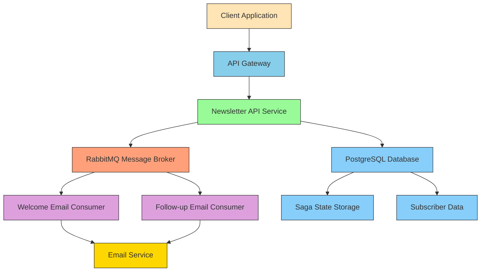

# System Architecture

## Event-Driven Architecture Diagram

## Message Flow

1. **Subscription Event Flow**:
   - Client sends subscription request to Newsletter API
   - API publishes `SubscribeToNewsLetter` event to RabbitMQ
   - `SubscribeToNewsLetterHandler` consumes event and creates subscriber record
   - Handler publishes `SubscriberCreated` event

2. **Welcome Email Flow**:
   - Saga consumes `SubscriberCreated` event
   - Saga transitions to Welcoming state
   - Saga publishes `SendWelcomeEmail` command
   - `SendWelcomeEmailHandler` consumes command and sends email
   - Handler publishes `WelcomeEmailSent` event

3. **Follow-up Email Flow**:
   - Saga consumes `WelcomeEmailSent` event
   - Saga transitions to FollowingUp state
   - Saga publishes `SendFollowUpEmail` command
   - `SendFollowUpEmailHandler` consumes command and sends email
   - Handler publishes `FollowUpEmailSent` event

4. **Completion Flow**:
   - Saga consumes `FollowUpEmailSent` event
   - Saga transitions to Onboarding state and finalizes
   - Saga publishes `OnboardingCompleted` event