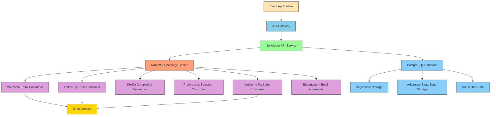

# System Architecture

## Event-Driven Architecture Diagram

## Message Flow

### 1. Basic Subscription Event Flow:
   - Client sends subscription request to Newsletter API
   - API publishes `SubscribeToNewsLetter` event to RabbitMQ
   - `SubscribeToNewsLetterHandler` consumes event and creates subscriber record
   - Handler publishes `SubscriberCreated` event

### 2. Welcome Email Flow:
   - Saga consumes `SubscriberCreated` event
   - Saga transitions to Welcoming state
   - Saga publishes `SendWelcomeEmail` command
   - `SendWelcomeEmailHandler` consumes command and sends email
   - Handler publishes `WelcomeEmailSent` event

### 3. Follow-up Email Flow:
   - Saga consumes `WelcomeEmailSent` event
   - Saga transitions to FollowingUp state
   - Saga publishes `SendFollowUpEmail` command
   - `SendFollowUpEmailHandler` consumes command and sends email
   - Handler publishes `FollowUpEmailSent` event

### 4. Completion Flow:
   - Saga consumes `FollowUpEmailSent` event
   - Saga transitions to Onboarding state and finalizes
   - Saga publishes `OnboardingCompleted` event

### 5. Advanced Onboarding Flow:
   - Client triggers advanced onboarding workflow
   - System creates advanced saga instance
   - Subscriber completes profile (ProfileCompleted event)
   - Subscriber selects preferences (PreferencesSelected event)
   - System sends welcome package (WelcomePackageSent event)
   - System schedules engagement email (EngagementEmailScheduled event)
   - Onboarding completes

### 6. Compensation Flow:
   - If any step fails, compensation commands are issued
   - Previous steps are rolled back to maintain consistency
   - System transitions to Faulted state

## Saga State Management

### Basic Newsletter Onboarding Saga States:
- **Initial**: Starting state
- **Welcoming**: Sending welcome email
- **FollowingUp**: Sending follow-up email
- **Onboarding**: Onboarding completed
- **Faulted**: Error state

### Advanced Newsletter Onboarding Saga States:
- **Initial**: Starting state
- **AwaitingProfileCompletion**: Waiting for profile completion
- **AwaitingPreferencesSelection**: Waiting for preferences selection
- **SendingWelcomePackage**: Sending welcome package
- **SchedulingEngagementEmail**: Scheduling engagement email
- **OnboardingCompleted**: Onboarding completed
- **Compensating**: Rolling back previous steps
- **Faulted**: Error state

## Retry and Fault Handling

### Message Retry Policy:
- Immediate retry 3 times
- Interval retry 3 times with 5-second delays
- Messages moved to Dead Letter Queue after maximum retries

### Error Handling:
- Detailed logging with structured error information
- Metrics collection for error tracking
- Distributed tracing for error propagation analysis
- Automatic compensation for failed operations

## Monitoring and Observability

### Metrics Collection:
- Subscription counts
- Email sending statistics
- Saga state transitions
- Error rates and types
- Performance metrics

### Distributed Tracing:
- End-to-end request tracking
- Service-to-service call tracing
- Database operation tracing
- Message queue tracing

### Health Checks:
- API endpoint availability
- Database connectivity
- Message broker connectivity
- Dependent service status